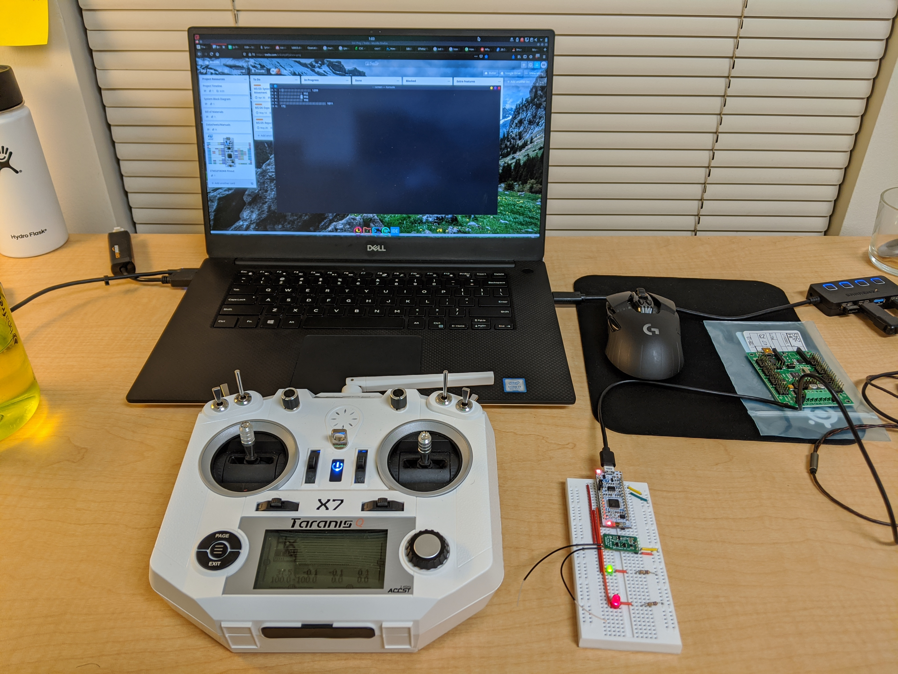

### Senior Design Project: rcHex

**California Polytechnic State University, San Luis Obispo**

**Spring 2020**

Advisor: [Dr. Paul Hummel](https://ee.calpoly.edu/faculty/phummel/)

---

rcHex is a radio-controlled hexapod with 18 degrees of freedom, capable 
of positional and rotational body adjustment as well as omnidirectional 
travel at variable speeds using three common gaits. This project 
explores some of the design intricacies of hexapod movement, including 
gait sequencing and the application of inverse kinematics to 
multi-jointed limbs.

https://digitalcommons.calpoly.edu/cpesp/324/

--
### Photos and Videos

Testing SBUS packet parsing from the receiver visually in a terminal:

Breadboard with the receiver, MCU, the servo control board, a couple indicator LEDs, and an assembled leg with three servos:

Assembly of some more legs:

An early experiment of getting two legs to work symmetrically ([YouTube](https://youtu.be/MIwPTrWXzRw)):

The servo control board mounted internally on the frame:

Transitioned from breadboard to a perfboard and 3D-printed mount:

The perfboard mounted on top of the frame:

Wiring up eighteen servos led to a rat's nest:

Demonstration of stationary movement ([YouTube](https://youtu.be/4tuCYG-LBBU)):

Demonstration with tripod crawling ([YouTube](https://youtu.be/dFqTliT88VE)):

